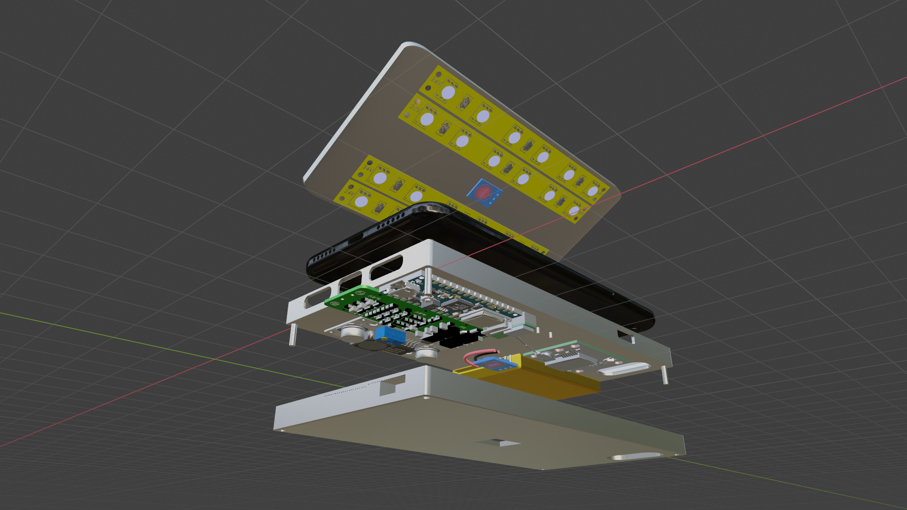
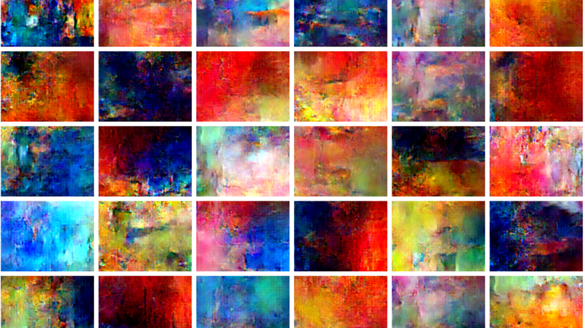
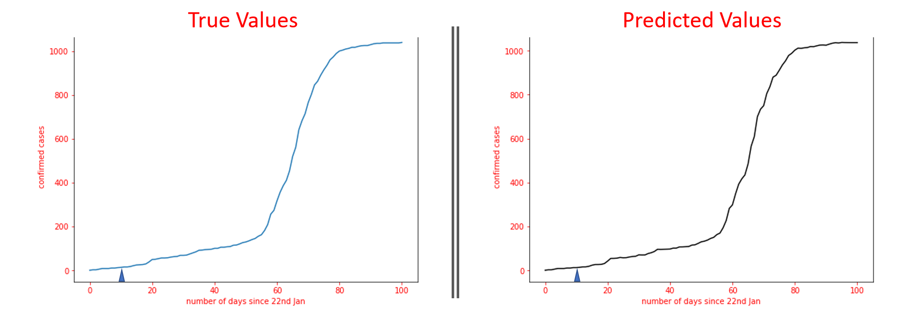
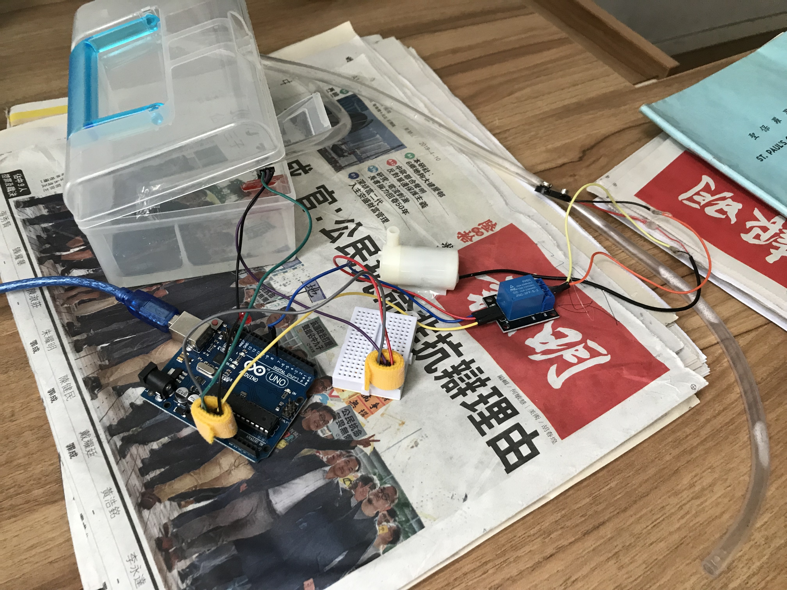

# My Projects

---

<a href='#ongoing'>Ongoing Projects</a>

<a href='#completed'>Completed Projects</a>

 

<h2 id='ongoing'>Ongoing Projects</h2>

UV Phone Case

> Together with several teammates from HKAGE, we propose a design for a smart UV-sterilizing phone case. It sterilizes your phone with UV light, 

 

浪淘沙

> 

 

Teens Speak Out

> This is an attempt at running a blog to spread the voice of teenagers. It was founded by one of my friends, and I'm one of its main editors. It is based on an earlier blog of similar nature (<a href='https://lockdownblog.org'>Teens On Lockdown</a>), although this earlier blog was mainly targeted at pandemic.

 

Project Leventis

> With several friends at

 

<h2 id='completed'>Completed Projects</h2>

[ 08/2020 ]:		Volunteer Teaching

> This is a community-service programme that I initiated in response to the pandemic. I really wanted to help children learn better and bring them joy in these difficult times, hoping to lessen the impact of the pandemic on the academic life of primary-school children. Therefore, I formed a team together with some of my friends, and volunteered to teach English.
>
> We had to look for multiple organisations before one offered to help us reach out for interested primary school children. Even though this is nothing big and in the end, only a few kids applied, we still found it meaningful to have left an impact during COVID-19.

 

[ 05/2020 ]:		Arspiration - _Generating Abstract Art with DCGAN_

 

[ 04/2020 ]:		Forecasting Coronavirus Cases - _Using time series forecasting to predict the number of COVID cases_

> 

 

[ 02/2020 ]: 		Polaris (My Shell Project) - _Assistant for the isolated elderly_

This video below shows Polaris in action! 👇

<iframe width="560" height="315" src="https://www.youtube.com/embed/ZCT6T0sybs4" frameborder="0" allow="accelerometer; autoplay; encrypted-media; gyroscope; picture-in-picture" allowfullscreen></iframe>

> Presentation materials: [Polaris Presentation](static/polaris-presentation.pdf)

 

[ 12/2019 ]: 		HaikuGAN - _Research projects with Prof. LEE Tan, CUHK_

> Final report: [Vincent Song - TECS3461 Report](static/Vincent-Song-TECS3461-Report.pdf)

 

[ 06/2019 ]: 		Project LAWS - _Automatic Watering System_

> 

 

